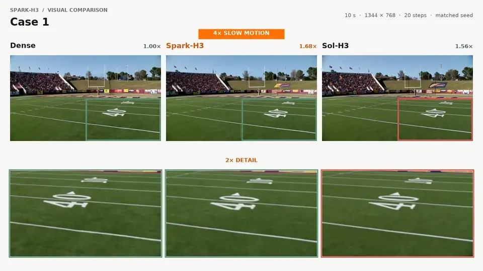

<div align="center">

<h1>⚡ Spark-H3</h1>
<h3>Block sparse attention for MiniMax-H3 video generation</h3>

<p><strong>Reblock similar tokens · Reweight unselected blocks</strong></p>

<p>
  <a href="https://github.com/zechengtang/Spark-H3"></a>
  <a href="https://zechengtang.github.io/Spark-H3/"></a>
  <a href="h3_sparse_attention/README.md"></a>
  <a href="LICENSE"></a>
  <a href="https://huggingface.co/MiniMaxAI/MiniMax-H3"></a>
</p>

<p>
  <a href="#demo">🎬 Demo</a> &nbsp;·&nbsp;
  <a href="#quick-start">🚀 Quick Start</a> &nbsp;·&nbsp;
  <a href="https://zechengtang.github.io/Spark-H3/">📖 Technical Blog</a> &nbsp;·&nbsp;
  <a href="#todo">🗓️ TODO</a>
</p>

</div>

---

## ✨ Spark-Attn

Spark-Attn is a block sparse attention method for MiniMax-H3 video generation.
It combines two operations:

- **🧩 Reblocking** groups similar tokens into blocks so sparse attention can
  select more relevant interactions.
- **⚖️ Reweighting** uses query-conditioned key/value summaries to approximate
  unselected blocks while preserving their attention mass and value contribution.

Spark-H3 provides the Spark attention kernels and MiniMax-H3 inference
integration. Conditioning video, text, and audio retain exact attention handling.

<a id="demo"></a>

## 🎬 Demo

The full demo compares Dense, Spark-H3, and Sol-H3 with matched seeds, then
shows Spark-H3 integrated with the 8-step LightX2V LoRA. The animated preview
collects the current slow-motion detail segments from Cases 1–3.

[](assets/spark-h3-demo.mp4)

<p align="center"><a href="assets/spark-h3-demo.mp4">▶ Watch the full demo with sound</a></p>

<a id="quick-start"></a>

## 🚀 Quick Start

Set up your H3 pipeline using the [upstream MiniMax-H3 instructions](https://github.com/MiniMax-AI/MiniMax-H3),
then install Spark in the same environment with a compatible PyTorch/CUDA stack:

```bash
python -m pip install -e '.[cuda]'
```

Wrap an already loaded pipeline with the Spark installer:

```python
from h3_sparse_attention import install_h3_spark_attn

with install_h3_spark_attn(pipe.transformer, num_inference_steps=20):
    result = pipe(**inputs, num_inference_steps=20)
```

### Step-count convention

MiniMax-H3's PyTorch pipeline uses `num_inference_steps` for denoising grid
points, so `N` grid points produce `N - 1` model evaluations: the usual 20–50
range therefore means 19–49 evaluations. Spark follows this convention. In
ComfyUI, `steps` directly counts evaluations; use 19 ComfyUI steps to match a
PyTorch run with `num_inference_steps=20`.

For ComfyUI's native MiniMax-H3 implementation, this repository also ships an
SM120 model-patch node. See the [ComfyUI installation and workflow guide](COMFYUI.md).

`inputs` contains your pipeline's generation arguments. The context manager
restores the original attention processors on exit.

→ See the [usage and configuration guide](h3_sparse_attention/README.md) for
requirements, defaults, and options.

<a id="todo"></a>

## 🗓️ TODO

- [x] Release the ComfyUI integration.
- [ ] Release a Ref2VA inference example.
- [ ] Release the technical report.
- [ ] Optimize the Spark kernels.
- [ ] Verify the kernels on SM90 and implement SM80 support.

## 🤝 Acknowledgments
 
Thanks to [MiniMax-H3](https://github.com/MiniMax-AI/MiniMax-H3) and
[Sol-Attn / Sol-Engine](https://github.com/NVlabs/Sana/tree/sol-engine) for the
model and attention infrastructure. See the [third-party notices](sol_attn/THIRD_PARTY_NOTICES.md)
for kernel attributions and included licenses.

## 📄 License

Spark-Attn’s original code and documentation are licensed under the
[Apache License 2.0](LICENSE). Third-party components retain their original
licenses and notices; see [third-party notices](sol_attn/THIRD_PARTY_NOTICES.md).
MiniMax-H3 model weights remain subject to their upstream license.
