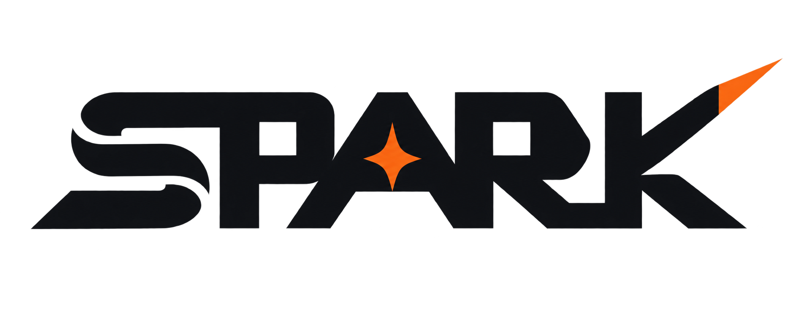
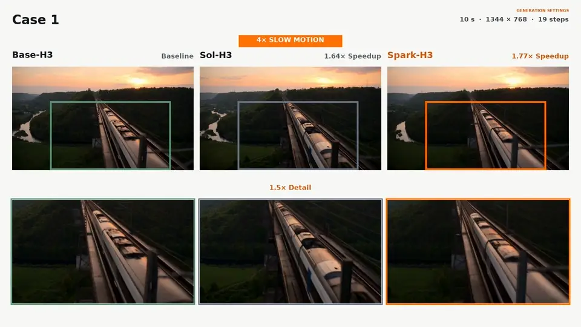

<div align="center">

<h1></h1>
<h3>Adaptive Block Sparse Attention for MiniMax-H3</h3>

<p><strong>Reblock similar tokens · Reweight tail tokens</strong></p>

<p>
  <a href="https://zechengtang.github.io/Spark-H3/"></a>
  
  <a href="https://huggingface.co/Aazeus/Spark-H3"></a>
  <a href="comfyui/README.md"></a>
  <a href="h3_sparse_attention/README.md"></a>
  <a href="LICENSE"></a>
</p>

<p>
  <a href="#demo">🎬 Demo</a> &nbsp;·&nbsp;
  <a href="#quick-start">🚀 Quick Start</a> &nbsp;·&nbsp;
  <a href="#comfyui-installation">🧩 ComfyUI</a> &nbsp;·&nbsp;
  <a href="https://zechengtang.github.io/Spark-H3/">📖 Technical Blog</a> &nbsp;·&nbsp;
  <a href="#project-status">🧭 Project Status</a>
</p>

</div>

---

## ✨ Spark-Attn

Spark-Attn is a block sparse attention method for MiniMax-H3 video generation.
It combines two operations:

- **🧩 Reblocking** groups similar tokens into blocks so sparse attention can
  select more relevant interactions.
- **⚖️ Reweighting** assigns different weights to tokens within each tail block
  when building key/value summaries, with a correction for attention mass.

Spark-H3 provides the Spark attention kernels and MiniMax-H3 inference integration.

<a id="demo"></a>

## 🎬 Demo


[](assets/spark-h3-demo.mp4)

<p align="center"><a href="assets/spark-h3-demo.mp4">▶ Watch the full demo with sound</a></p>

<a id="quick-start"></a>

## 🚀 Quick Start

Set up your H3 pipeline using the [upstream MiniMax-H3 instructions](https://github.com/MiniMax-AI/MiniMax-H3),
then install Spark in the same environment with a compatible PyTorch/CUDA stack:

```bash
python -m pip install -e '.[cuda]'
```

Wrap an already loaded pipeline with the Spark installer:

```python
from h3_sparse_attention import install_h3_spark_attn

# MiniMaxH3Scheduler includes the terminal sigma=0 in num_inference_steps,
# but that terminal point does not run the transformer.
num_denoise_steps = 19
num_inference_steps = num_denoise_steps + 1

with install_h3_spark_attn(
    pipe.transformer,
    num_denoise_steps=num_denoise_steps,
    warmup_mode="warmup_steps",
    warmup_steps=4,
    dense_layers=1,
    topk_ratio=0.1,
):
    result = pipe(**inputs, num_inference_steps=num_inference_steps)
```

<a id="comfyui-installation"></a>

### ComfyUI standalone installation

The ComfyUI integration can be distributed as a small standalone custom-node
ZIP instead of cloning this complete research repository. A release bundle
contains the node, its reblock runtime, example workflows, and—when available—a
matching Spark-enabled `comfy-kitchen` wheel. It does not contain model weights.

For tagged releases that include the artifact, download
`ComfyUI-Spark-H3-<version>.zip` from the release assets, then extract it
directly under `ComfyUI/custom_nodes`:

```bash
cd /path/to/ComfyUI/custom_nodes
unzip /path/to/ComfyUI-Spark-H3-<version>.zip

# Always use the same Python interpreter that starts ComfyUI.
/path/to/ComfyUI/.venv/bin/python ComfyUI-Spark-H3/install.py
```

The installer checks for an existing compatible backend, then tries a bundled
wheel and the pinned release wheel. Only when none matches does it clone the
pinned `comfy-kitchen` source, apply the bundled Spark patch, and compile it.
Source fallback requires Git, CMake, Ninja, a C++ compiler, and CUDA `nvcc`.

The currently validated prebuilt configuration is Linux x86_64, Python 3.12+
and an NVIDIA SM120 GPU. Python 3.10/3.11 needs a matching wheel or the source
fallback. Windows packaging is prepared but a Windows wheel and SM120 runtime
still require separate validation. The Spark node itself executes only on
SM120; `strict=false` on another GPU tests dense fallback, not Spark.

After restarting ComfyUI, add **MiniMax H3 Spark Attention (SM120)** between the
native MiniMax-H3 model loader and `BasicGuider`. See the
[ComfyUI guide](comfyui/README.md) for model placement, workflows, and node
parameters.

Maintainers can assemble the standalone directory and deterministic ZIP from a
source checkout:

```bash
python tools/build_comfyui_package.py \
  --publisher-id YOUR_COMFY_REGISTRY_PUBLISHER_ID \
  --kernel-wheel /path/to/comfy_kitchen-0.2.36+spark.h3.1-*.whl
```

### Step-count convention

`MiniMaxH3Scheduler` includes the final `σ=0` endpoint in
`num_inference_steps`, so the default `num_inference_steps=50` runs 49 denoising steps. See the
[Hugging Face scheduler documentation](https://huggingface.co/docs/diffusers/main/api/schedulers/minimax_h3).

<!-- ### Benchmark comparability

Match the **actual** `torch.compile` state across all Diffusers runs before
comparing quality or speed. In a controlled 25-prompt H3 check, switching
denoising compilation changed Spark PSNR by **3.15 dB**, despite otherwise
matched settings. This is a protocol difference, not evidence of a Spark
kernel regression. Do not mix compiled and uncompiled benchmark results.
The sibling MiniMax-H3-Benchmark's standard Diffusers denoising runner and
radial/attention harnesses require compilation and verify that all transformer
blocks were wrapped. Do not mix their results
with historical uncompiled experiments.

`inputs` contains your pipeline's generation arguments. The context manager
restores the original attention processors on exit.

→ See the [usage and configuration guide](h3_sparse_attention/README.md) for
requirements, defaults, and options. -->

<a id="todo"></a>
<a id="project-status"></a>

## 🧭 Project Status & Roadmap

| Status | Item | Resources |
|---|---|---|
| ✅ Available | Fused Spark kernels for SM80 and SM120 | [Kernel documentation](h3_sparse_attention/README.md) · [Performance matrix](docs/kernel_performance_matrix.md) |
| ✅ Available | Standalone ComfyUI node packaging with wheel-first installation and source fallback | [ComfyUI guide](comfyui/README.md) |
| ✅ Available | Release Ref2VA inference examples | [Spark-Ref2VA Preview](docs/blogs/spark-attn/README.md#spark-ref2va-preview) |
| 🚧 In progress | Test and validate the ComfyUI implementation on NVIDIA GeForce RTX 50 series | — |
| 🗓️ Planned | Standalone stable ComfyUI implementation without a `comfy-kitchen` dependency | — |
| 🗓️ Planned | Fused Spark kernels for SM90 and SM100 | Pending resources |
| 🗓️ Planned | Release the technical report | — |

## 🤝 Acknowledgments
 
Thanks to [MiniMax-H3](https://github.com/MiniMax-AI/MiniMax-H3) and
[Sol-Attn / Sol-Engine](https://github.com/NVlabs/Sana/tree/sol-engine) for the
model and attention infrastructure. See the [third-party notices](sol_attn/THIRD_PARTY_NOTICES.md)
for kernel attributions and included licenses.

## 📄 License

Spark-Attn’s original code and documentation are licensed under the
[Apache License 2.0](LICENSE). Third-party components retain their original
licenses and notices; see [third-party notices](sol_attn/THIRD_PARTY_NOTICES.md).
MiniMax-H3 model weights remain subject to their upstream license.
