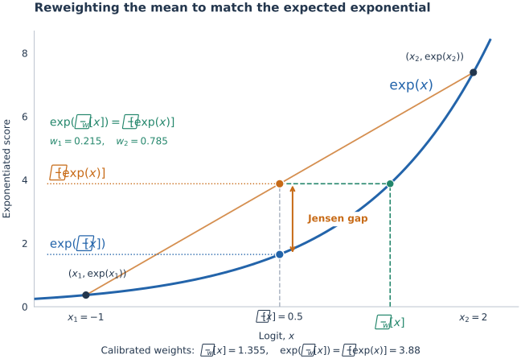

# Spark-H3: Better Block Sparse Attention for MiniMax-H3

September 13, 2026 · SparkH3 Team 
<!-- PKU · NJU -->

<!-- VDN10_SHOWCASE -->

**Block-Sparse Attention (BSA)** splits attention into two complementary branches: an **exact branch** that computes selected blocks exactly, and a **compressed branch** that covers the remaining content at much lower complexity. However, fixed block partitioning limits the exact branch, and mean estimation — a common construction of the compressed branch — biases its estimates. We introduce **Spark-Attn**, comprising **Spark-Reblock** and **Spark-Reweight**, to improve the two branches. We refer to its MiniMax-H3 implementation as **Spark-H3**.

- **Spark-Reblock** improves the exact branch: it partitions tokens according to attention preference, improving attention mass recall at the same budget.
- **Spark-Reweight** improves the compressed branch with weighted summaries and a log-mass bias, reducing the bias introduced by mean pooling.
- **Benchmark Results** evaluates Spark-H3's fidelity, visual quality, and acceleration against dense attention and Sol-Attn.
- **Spark-Integration** applies Spark-H3 to FastH3 and to few-step LoRAs from Larryvrh and LightX2V.
- **Visual Comparisons** presents paired Dense and Spark-H3 outputs generated with matching prompts and seeds.

## Spark-Reblock

*~2 min read*

Block-level scoring works better when tokens within each block are more similar. Common block layouts group consecutive tokens or use fixed spatio-temporal tiles. These layouts provide efficient, regular blocks, but do not account for differences across inputs and layers.

Two aspects of video diffusion help explain why these differences matter.

**Noise weakens the spatio-temporal prior.** Denoising starts from independent Gaussian noise and gradually recovers structure. Nearby positions in the noise do not have an inherent similarity advantage. A spatio-temporal neighborhood that aligns well with a clean video may therefore be less well suited to the attention-relevant similarity structure during early denoising.

*Illustration: [Yang Song, Generative Modeling by Estimating Gradients of the Data Distribution](https://yang-song.net/blog/2021/score/).*

**Similarity patterns vary across inputs and layers.** Each layer and head learns its own similarity measure, so which tokens are similar depends on both the model’s learned weights and the input. A single fixed block partitioning may not match these varying similarity patterns well.

We propose **Spark-Reblock** to account for both effects by grouping tokens with similar attention preferences into the same blocks. More precisely, two queries are considered similar if they produce similar attention-score patterns over the key distribution, while two keys are considered similar if they receive similar scores across the query distribution. We quantify these relationships using a Mahalanobis cosine distance induced by the opposite side's second moment:

$$
d_Q(q_i,q_j)=1-\cos\!\big(M_K^{1/2}q_i,\,M_K^{1/2}q_j\big),\qquad M_K=\mathbb{E}[kk^\top],
$$

and symmetrically for keys with $M_Q=\mathbb{E}[qq^\top]$. These distances make “similar” explicit: query tokens are grouped under $d_Q$, and key tokens under its symmetric counterpart $d_K$. Starting from the full token set, our iterative hierarchical partitioner repeatedly splits every current group according to the corresponding distance while enforcing the assigned child capacities. The process continues level by level until every leaf contains exactly the target block size. Because the hierarchy adapts to the current input, layer, and head, it can follow their different similarity structures; its time complexity is $\mathcal{O}(N \log N)$, where $N$ is the number of tokens.

The following animation illustrates recursive partitioning: split the parent according to assigned child capacities, apply the same operation within each child, and stop at the leaf block size. Token IDs track membership through the tree and the attention matrix shows the resulting permutation.

<iframe class="spark-animation" src="/animations/spark-reblock.html" title="Spark-Reblock: recursive splitting into token blocks" loading="lazy"></iframe>

For ablation, we use a BSA baseline with fixed block partitioning. Each query block's exact branch covers the top 10% of video key-value blocks; its compressed branch mean-pools the remaining blocks. For a query block $Q_A$:

$$
\operatorname{BSA}(Q_A)=\operatorname{Softmax}\!\left(\frac{Q_A\widetilde{K}_A^\top}{\sqrt{d}}\right)\widetilde{V}_A.
$$

The effective keys $\widetilde{K}_A$ and values $\widetilde{V}_A$ are assembled by concatenating over all key-value blocks $B$:

$$
\begin{aligned}
\widetilde{K}_A
&=\operatorname{Concat}_{B}
\begin{cases}
K_B, & B\in\mathcal{S}_A, \\[4pt]
\mathbf{1}_{|B|}\bar{k}_B^\top, & B\notin\mathcal{S}_A,
\end{cases} \\[8pt]
\widetilde{V}_A
&=\operatorname{Concat}_{B}
\begin{cases}
V_B, & B\in\mathcal{S}_A, \\[4pt]
\mathbf{1}_{|B|}\bar{v}_B^\top, & B\notin\mathcal{S}_A.
\end{cases}
\end{aligned}
$$

Here, $\mathcal{S}_A$ is the set of blocks selected for the exact branch, and $\bar{k}_B$ and $\bar{v}_B$ are the mean key and value of block $B$. The all-ones vector $\mathbf{1}_{|B|}$ repeats each mean across the block's token positions, so every token contributes with equal weight — a uniform mean estimate. A single row-wise softmax normalizes both branches' contributions together.

The compressed branch matches Sol-Attn's mean-pooled approximation, while routing differs: we use a fixed Top-K budget instead of a content-adaptive threshold. Context/sink tokens remain exact and are outside the video-block Top-K budget.

The ablation replaces only the baseline's fixed block partitioning with Spark-Reblock; routing, the sparse schedule, and all other settings remain unchanged.

| Method | density ↓ | Attention-mass recall ↑ | PSNR dB ↑ | SSIM ↑ | LPIPS ↓ |
| --- | ---: | ---: | ---: | ---: | ---: |
| BSA | 10% | 68.66% | 18.61 | 0.68 | 0.26 |
| BSA + Reblock | 10% | 81.54% | 22.41 | 0.80 | 0.14 |

At a Top-K attention budget of **10%**, Spark-Reblock increases attention-mass recall by **12.88 percentage points** and improves mean PSNR by **3.80 dB**. These results demonstrate the benefit of adaptive block partitioning over fixed block partitioning at the same attention budget.

### Discussion

Concurrent work [VC-Attention](https://arxiv.org/html/2609.15810) uses single-level online $k$-means guided by value-token similarity to reorder keys and values for low-bit quantization. Because the cluster sizes are unconstrained, the sorted sequence is subsequently partitioned at fixed hardware-block boundaries to retain a regular, fixed-size block layout. Spark-Reblock instead uses an iterative divide-and-conquer hierarchy guided by query-key-induced attention-preference similarity to construct fixed-capacity blocks for sparse attention.

[LLSA](https://arxiv.org/abs/2512.16615) also achieves $O(N\log N)$ sparse attention through a hierarchy, recursively pooling fixed neighboring blocks and applying coarse-to-fine Top-K selection. LLSA uses the hierarchy to search interactions over a fixed layout, while Spark-Reblock uses it to adapt the token layout itself. From a log-linear-attention perspective, Spark-Reblock can be understood as an $O(N\log N)$ attention-like probe of the underlying $O(N^2)$ dense attention distribution: instead of materializing the full attention matrix, it infers its structure and rearranges tokens so that fixed-size blocks align better with the resulting attention geometry.

## Spark-Reweight

*~2 min read*

Mean pooling underestimates attention mass because of the **Jensen gap**. Attention exponentiates logits before normalization, but pooling first replaces $\mathbb{E}[\exp(x)]$ with $\exp(\mathbb{E}[x])$, which therefore underestimates the expected exponential. When pooled blocks are combined with exact blocks, this underestimate suppresses their contribution to the output.

**Spark-Reweight** mitigates the resulting bias by scoring each block once with a representative query. These scores produce weighted key and value summaries, along with a log-mass bias used to correct the block's total attention mass. The weighted summaries and bias are then reused to approximate the block contribution for each query. To avoid per-query weighting—which would incur the full $N \times N$ cost—we use the mean of the video queries as the representative. This only adds a linear $O(N)$ scoring pass.

*In this two-logit illustration, mean pooling produces $\exp(\mathbb{E}[x])$, shown in blue, below the expected exponential $\mathbb{E}[\exp(x)]$, shown in orange. The green point shows the effective pooled logit after applying the log-mass bias; its exponential matches the expected exponential.*

The animation illustrates how weighted summaries and a log-mass bias produce a corrected estimate of the compressed block's contribution.

<iframe class="spark-animation" src="/animations/spark-reweight.html" title="Spark-Reweight: correct attention mass and value together" loading="lazy"></iframe>

Using the same BSA baseline and evaluation protocol as the Spark-Reblock ablation, this experiment retains the fixed block partitioning and disables reblocking. It changes only the compressed-branch estimator, replacing mean pooling with Spark-Reweight's weighted pooling and log-mass bias; routing remains unchanged. Absolute log-mass error measures the difference between the exact total log-mass of the compressed branch and its approximation.

| Method | density ↓ | Abs log-mass error (nats) ↓ | PSNR dB ↑ | SSIM ↑ | LPIPS ↓ |
| --- | ---: | ---: | ---: | ---: | ---: |
| BSA | 10% | 3.86 | 18.61 | 0.68 | 0.26 |
| BSA + Reweight | 10% | 2.78 | 19.17 | 0.70 | 0.24 |

At the same 10% density, Spark-Reweight reduces mean absolute log-mass error by **28%** and improves mean PSNR by **0.56 dB**.

## Benchmark Results

*~3 min read*

**Evaluation setup.** We compare Dense, Sol-Attn, and two Spark-H3 variants on VBench prompts using 20 steps, 1344×768 resolution, and 240 frames at 24 fps. Sol-Attn uses its official setting. Spark-H3-10pct uses 90% sparse BSA with reblock and reweight; Spark-H3-20pct uses an 80% sparse budget with the same components. Quality is paired against dense references with identical prompts and seeds.

| Method | DiT latency (s) ↓ | PSNR (dB) ↑ | SSIM ↑ | LPIPS ↓ | DiT speedup ↑ | ATTN speedup ↑ | density ↓ |
| --- | ---: | ---: | ---: | ---: | ---: | ---: | ---: |
| Dense | 582.1 | ∞ | 1.00 | 0.00 | 1.00× | 1.00× | 100% |
| Sol-H3 | 364.9 | 20.36 | 0.71 | 0.20 | 1.59× | 2.19× | — |
| Spark-H3-10pct | 341.7 | 23.30 | 0.80 | 0.14 | 1.70× | 2.33× | 10% |
| Spark-H3-20pct | 378.2 | 25.38 | 0.85 | 0.09 | 1.54× | 1.96× | 20% |

On the same videos, VBench measures subject and background consistency, motion smoothness, imaging quality, and aesthetic quality; higher is better for every dimension.

| Method | Subject consistency ↑ | Background consistency ↑ | Motion smoothness ↑ | Imaging quality ↑ | Aesthetic quality ↑ |
| --- | ---: | ---: | ---: | ---: | ---: |
| Dense | 90.75 | 93.88 | 99.02 | 72.14 | 67.59 |
| Sol-H3 | 91.14 | 94.10 | 98.96 | 72.12 | 67.49 |
| Spark-H3-10pct | 90.77 | 94.24 | 99.01 | 71.81 | 68.22 |
| Spark-H3-20pct | 90.92 | 94.25 | 99.01 | 72.08 | 67.73 |

At 10% density, Spark-H3 achieves lower DiT latency than Sol-H3 (341.7 versus 364.9 seconds) while preserving the dense output more faithfully across PSNR, SSIM, and LPIPS. Increasing the density to 20% further improves fidelity, reaching 25.38 dB PSNR, 0.85 SSIM, and 0.09 LPIPS with a modest latency trade-off. Both Spark-H3 variants also closely track the Dense baseline across the reported VBench dimensions, with no broad degradation in visual quality. Together, these results show that Spark-H3 offers a strong fidelity–efficiency trade-off for attention acceleration.

## Spark-Integration

*~3 min read*

Few-step distillation reduces the number of denoising steps, while attention acceleration reduces the cost of each step. FastH3 and OpenVDN already combine these two complementary approaches. The experiments below follow the same strategy by integrating Spark-H3 into FastH3's Dense pipeline and the few-step LoRA pipelines from LightX2V and Larryvrh.

Unless noted otherwise, the integration examples use 1344×768 resolution, 240 frames at 24 fps, and Spark-H3 at 10% attention density, denoted **Spark-H3-10pct** below. FastH3 and few-step LoRA runs use per-block `torch.compile` on a single NVIDIA RTX PRO 6000 Blackwell Server Edition GPU with 96 GB of memory. In the no-warmup setting, Spark-H3 runs from the first step. The warmup setting keeps the first transformer layer dense throughout and uses dense attention for the first step of the 4-step FastH3 schedule and the first two steps of the 8-step LoRA schedules.

### Fast-H3: an alternative for fixed block partitioning

The comparisons below show native Fast-H3 checkpoint variants alongside its V1 Dense checkpoint with Spark-H3-10pct as the attention backend. V1 variants use four steps; V2 VSA uses eight. The results illustrate how Spark-H3 transfers to a distilled dense checkpoint and suggest Spark-Reblock as an alternative to VSA's fixed spatio-temporal block partitioning.

Both VSA variants can load with all weights resident, but inference then exceeds the available 96 GB of GPU memory. We therefore use layerwise offloading. Their reported latencies include CPU–GPU transfer overhead and could be lower with more GPU memory.

<!-- FASTH3_INTEGRATION -->

### Larryvrh 8-step LoRA

[Larryvrh MiniMax-H3 few-step LoRA](https://huggingface.co/larryvrh/MiniMax-H3-Turbo-Lora) is evaluated with dense attention and two Spark-H3-10pct schedules using matching prompts and seeds under the shared protocol above.

<!-- LARRY_INTEGRATION -->

### LightX2V 8-step LoRA

[LightX2V MiniMax-H3 few-step LoRA](https://huggingface.co/lightx2v/Minimax-h3-Turbo) is evaluated under the same protocol as the Larryvrh comparisons above.

<!-- LIGHTX2V_INTEGRATION -->

### Video DeltaNet

[Video DeltaNet (VDN)](https://openvdn.github.io/) can be viewed as a special case of BSA in which each block corresponds to one latent frame and a fixed rule selects the exact branch. For each latent frame, this branch covers a local neighborhood of 15 latent frames together with the first and last latent frames, for 17 exact latent frames in total. The remaining context is handled by a DeltaNet branch adapted through training rather than by a pooled compressed branch.

Because there is no corresponding dense checkpoint for the Video DeltaNet weights, we cannot directly integrate Spark-H3 into the same model. We therefore compare their speedups under VDN's longer 345-frame, 14.4-second setting. The table reports average latency per step and measures each speedup against Dense at the same precision.

| Method | Dtype | Per-step DiT latency (s) ↓ | Per-step ATTN latency (s) ↓ | DiT speedup ↑ | ATTN speedup ↑ |
| --- | --- | ---: | ---: | ---: | ---: |
| Dense | BF16 | 56.36 | 49.45 | 1.00× | 1.00× |
| Spark-H3-10pct (w/ warmup) | BF16 | 33.01 | 26.19 | 1.71× | 1.89× |
| Spark-H3-10pct (w/o warmup) | BF16 | 22.97 | 16.15 | **2.45×** | **3.06×** |
| VDN (8 steps) | BF16 | 24.54 | 17.90 | 2.30× | 2.76× |
| Dense | FP8 | 51.67 | 47.45 | 1.00× | 1.00× |
| Spark-H3-10pct (w/ warmup) | FP8 | 28.63 | 24.50 | 1.80× | 1.94× |
| Spark-H3-10pct (w/o warmup) | FP8 | 18.71 | 14.53 | **2.76×** | **3.27×** |
| VDN (8 steps) | FP8 | 19.76 | 15.77 | 2.62× | 3.01× |

In the fully sparse, no-warmup setting, Spark-H3 reaches per-step DiT speedups in a similar range to VDN: 2.45× versus 2.30× in BF16 and 2.76× versus 2.62× in FP8. However, without training adaptation, this fully sparse schedule may deviate more from the dense model. Its outputs may still be visually plausible, but fidelity to the dense model is not guaranteed. We therefore treat these results only as an optimistic speed upper bound, rather than evidence of comparable quality-preserving acceleration. Under the warmup schedule used to preserve dense fidelity, VDN remains faster. The upper-bound results instead suggest that training adaptation could potentially bring Spark-H3 closer to VDN-level speedups while maintaining fidelity.

<!--
The compressed branch is a shared design element, but its construction differs across methods: FastH3's VSA pools queries and keys/values alike, Sol-Attn and Spark-H3 pool only keys/values, and OpenVDN replaces pooling with a linear branch.

<iframe class="spark-animation" src="/animations/branch-comparison.html" title="The compressed branch across FastH3, Sol-Attn / Spark-H3 and OpenVDN" loading="lazy"></iframe>
-->

## Visual Comparisons

*~1 min read*

The comparisons below show 10-second videos at 1344×768 resolution. Dense and Spark-H3-10pct use matching prompts and seeds, and each video shows its measured DiT latency.

<!-- VIDEO_GALLERY -->

## Related Works

*~2 min read*

**MiniMax-H3.** MiniMax-H3 provides the underlying multimodal video-and-audio generation model used in our experiments. Spark-H3 targets the attention computation within this model. [Official repository](https://github.com/MiniMax-AI/MiniMax-H3), [Hugging Face model](https://huggingface.co/MiniMaxAI/MiniMax-H3).

**Sol-Attn.** Sol-Attn combines dynamic routing, sparse computation and approximation correction within an online-softmax pass. Our BSA operator is developed on top of the Sol-Attn operator implementation and retains its mean-pooled compressed branch. [Paper: Sol-Attn — Accelerating Video Generation Inference via On-the-Fly Attention Sparsification](https://arxiv.org/abs/2607.24027).

**FastH3.** FastH3 provides few-step distilled MiniMax-H3 checkpoints and trained VSA variants for accelerated inference. [Official FastH3 documentation](https://haoailab.com/FastVideo/cookbook/minimax-h3/), [FastVideo repository](https://github.com/hao-ai-lab/FastVideo).

**Video DeltaNet.** Video DeltaNet combines an exact softmax branch selected by a fixed temporal rule with a DeltaNet branch adapted through training for the remaining context. [OpenVDN project page](https://openvdn.github.io/).

**VC-Attention.** VC-Attention is a training-free low-bit attention framework. Its V-Smooth module uses online $k$-means to reorder keys and values so that similar value tokens tend to share a quantization block, while ExpCast-FP8 directly encodes attention probabilities in FP8. [Paper: VC-Attention — Value Smoothing and Softmax Casting for Low-bit Attention](https://arxiv.org/html/2609.15810).

**LLSA.** LLSA is a trainable $O(N\log N)$ sparse attention method that recursively mean-pools fixed blocks, performs hierarchical coarse-to-fine Top-K selection, and enriches the selected fine tokens with coarse keys and values to preserve global context. [Paper: Trainable Log-linear Sparse Attention for Efficient Diffusion Transformers](https://arxiv.org/abs/2512.16615).
