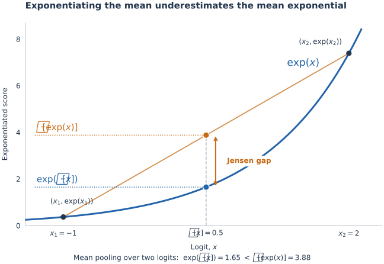

# Spark-H3: Better Block Sparse Attention for MiniMax-H3

September 13, 2026 · SparkH3 Team 
PKU · NJU · DreamTech

<!-- VDN10_SHOWCASE -->

**Block-Sparse Attention (BSA)** splits attention into two complementary branches: an **exact branch** that computes selected blocks exactly, and a **compressed branch** that covers the remaining content at much lower complexity. However, fixed block partitioning limits the exact branch, and mean estimation — a common construction of the compressed branch — biases its estimates. We introduce **Spark-Attn** to improve both branches:

- **Spark-Reblock** improves the exact branch: it partitions tokens according to attention preference, improving attention mass recall at the same budget.
- **Spark-Reweight** improves the compressed branch: it uses weighted rather than uniform mean estimation, reducing the Jensen-gap bias.
- **Spark-Integration** demonstrates the feasibility of combining Spark-Attn with few-step distilled acceleration, including FastH3.

## Spark-Reblock

*~3 min read*

Block-level scoring works better when tokens within each block are more similar. Common block layouts group consecutive tokens or use fixed spatio-temporal tiles. These layouts provide efficient, regular blocks, but do not account for differences across inputs and layers.

Two aspects of video diffusion help explain why these differences matter.

**Noise weakens the spatio-temporal prior.** Denoising starts from independent Gaussian noise and gradually recovers structure. Nearby positions in the noise do not have an inherent similarity advantage. A spatio-temporal neighborhood that makes sense in a clean video may therefore be a poor basis for forming attention blocks during denoising.

*Illustration: [Yang Song, Generative Modeling by Estimating Gradients of the Data Distribution](https://yang-song.net/blog/2021/score/).*

**Similarity patterns vary across inputs and layers.** Each layer and head learns its own similarity measure, so which tokens are similar depends on both the model’s learned weights and the input. A single fixed block partition cannot adapt to these different similarity patterns.

We propose **Spark-Reblock** to account for both effects by grouping similar tokens into the same blocks. “Attention preference” refers to which keys a query tends to attend to, and which queries tend to attend to a key. We use token similarity as a proxy for similar attention preferences, measured by Mahalanobis cosine distance under the opposite side's second moment:

$$
d_Q(q_i,q_j)=1-\cos\!\big(M_K^{1/2}q_i,\,M_K^{1/2}q_j\big),\qquad M_K=\mathbb{E}[kk^\top],
$$

and symmetrically for keys with $M_Q=\mathbb{E}[qq^\top]$. The partition adapts to the input and each layer and head’s learned similarity measure. A divide-and-conquer algorithm recursively splits tokens into groups of exactly block size, with time complexity $\mathcal{O}(N \log N)$, where $N$ is the number of tokens.

The animation illustrates recursive partitioning: split the parent according to assigned child capacities, apply the same operation within each child, and stop at the leaf block size. Token IDs track membership through the tree and the attention matrix shows the resulting permutation.

<iframe class="spark-animation" src="/animations/spark-reblock.html" title="Spark-Reblock: recursive splitting into token blocks" loading="lazy"></iframe>

For ablation, we use a BSA baseline with fixed block partitioning. Each query block's exact branch covers the top 10% of video key-value blocks; its compressed branch mean-pools the remaining blocks. For a query block $Q_A$:

$$
\operatorname{BSA}(Q_A)=\operatorname{Softmax}\!\left(\frac{Q_A\widetilde{K}_A^\top}{\sqrt{d}}\right)\widetilde{V}_A.
$$

The effective keys $\widetilde{K}_A$ and values $\widetilde{V}_A$ concatenate the following blocks:

$$
\bigl(\widetilde{K}_{A,B},\widetilde{V}_{A,B}\bigr)=
\begin{cases}
(K_B,V_B), & B\in\mathcal{S}_A \quad\text{(exact branch)}, \\[4pt]
(\mathbf{1}_{|B|}\bar{k}_B^\top,\mathbf{1}_{|B|}\bar{v}_B^\top), & B\notin\mathcal{S}_A \quad\text{(compressed branch)}.
\end{cases}
$$

Here, $\mathcal{S}_A$ is the set of blocks selected for the exact branch, and $\bar{k}_B$ and $\bar{v}_B$ are the mean key and value of block $B$. The all-ones vector $\mathbf{1}_{|B|}$ repeats each mean across the block's token positions, so every token contributes with equal weight — a uniform mean estimate. (The implementation computes the pooled contribution once with a block-size factor $|B|$, without expanding the repeated tokens.) A single row-wise softmax normalizes both branches' contributions together.

The compressed branch is the same as Sol-Attn's mean-pooled approximation. The difference is routing: we select a fixed Top-K budget using query/key block-centroid scores, whereas Sol-Attn uses a Gaussian-based threshold controlled by $\tau$ ($\mu+\tau\sigma$). Context/sink tokens remain exact and are outside the video-block Top-K budget.

The first 4 of 19 denoising steps and the first attention layer use dense attention. We then replace only the baseline's fixed block partitioning with Spark-Reblock using 8-way recursive splitting, keeping all other settings unchanged.

| Method | density ↓ | Attention-mass recall ↑ | PSNR dB ↑ | SSIM ↑ | LPIPS ↓ |
| --- | ---: | ---: | ---: | ---: | ---: |
| BSA | 10.00% | 68.61% | 17.68 | 0.64 | 0.30 |
| BSA + Reblock | 10.00% | 82.69% | 21.03 | 0.74 | 0.19 |

At a Top-K attention budget of **10%**, Spark-Reblock increases attention-mass recall by **14.08 percentage points**. It also improves mean PSNR by **3.35 dB** and mean SSIM by **0.10**, and reduces mean LPIPS by **0.12**. These results demonstrate the benefits of adaptive block partitioning over fixed block partitioning at the same attention budget.

## Spark-Reweight

*~2 min read*

Mean pooling underestimates attention mass because of the **Jensen gap**. Attention exponentiates logits before normalization, but pooling first replaces $\mathbb{E}[\exp(x)]$ with $\exp(\mathbb{E}[x])$, which therefore underestimates the expected exponential. When pooled blocks are combined with exact blocks, this underestimate suppresses their contribution to the output.

*For two equally weighted logits, the orange point marks $\mathbb{E}[\exp(x)]$ and the blue point marks $\exp(\mathbb{E}[x])$. Their vertical separation is the Jensen gap: pooling before exponentiation underestimates the expected exponential.*

We propose **Spark-Reweight** to reduce this bias using one shared query per group. The group's mean query scores every key within each key-value block, and log-sum-exp preserves the block's attention mass. The same attention weights produce weighted key and value summaries, keeping the value contribution consistent with the restored mass. Each query in the group uses the weighted key to adjust the shared log-mass with a first-order correction, then combines the weighted value with the exact blocks' contributions under a common normalization.

At the shared query, both mass and value contribution are exact in exact arithmetic; other queries use an approximation. Sharing is more accurate when queries in a group have similar attention preferences.

![The orange expectation point projects horizontally onto the exponential curve at the calibrated weighted mean E_w[x], with a vertical guide to the x-axis.](figures/reweight_correction.svg)

*In this two-logit illustration, weights $w_1\approx0.215$ and $w_2\approx0.785$ give $\mathbb{E}_w[x]=\log\mathbb{E}[\exp(x)]$. The horizontal line connects the orange point to $\exp(\mathbb{E}_w[x])$ on the curve, showing the exact match. These illustrative weights express the mass correction as a weighted mean.*

The animation shows how the pooled contribution recovers as its mass and value summary are updated. At the shared query, the completed update matches the dense output.

<iframe class="spark-animation" src="/animations/spark-reweight.html" title="Spark-Reweight: correct attention mass and value together" loading="lazy"></iframe>

The ablation uses top-k 10% and original contiguous 64-token blocks, without reblocking. The baseline uses mean pooling. Block-level Spark-Reweight uses one representative query per 64-token query block (1,134 representatives per head); global-level Spark-Reweight uses one representative for all 72,576 video queries per head, excluding context. The routing policy stays the same across methods.

| Method | PSNR dB ↑ | SSIM ↑ | LPIPS ↓ | Denoising time (s) |
| --- | ---: | ---: | ---: | ---: |
| BSA  | 17.68 | 0.64 | 0.30 | 333.71 |
| BSA + Block-level reweight | 18.23 | 0.67 | 0.28 | 385.49 |
| BSA + Global-level reweight | 18.14 | 0.66 | 0.28 | 346.06 |

Both Spark-Reweight variants improve mean PSNR, SSIM and LPIPS. Block-level Spark-Reweight improves mean PSNR by **0.56 dB**, while global-level Spark-Reweight retains a **0.46 dB** gain using a single representative per head.

## Spark-Integration

*~2 min read*

Spark-Attn can be combined with timestep distillation: distilled models reduce the number of denoising steps, while Spark-Attn operate within attention. The examples below demonstrate integration with 4-step Fast-H3 models and 8-step H3 Turbo LoRA models.

### 8-step distilled models

[LightX2V MiniMax-H3 Turbo](https://huggingface.co/lightx2v/Minimax-h3-Turbo) and [Larry MiniMax-H3 Turbo LoRA](https://huggingface.co/larryvrh/MiniMax-H3-Turbo-Lora) checkpoints are compared with dense attention and two Spark-H3-10pct schedules using matching prompts and seeds. Both sparse arms use 90% sparsity with the first transformer layer kept dense; the warmup arm additionally keeps the first two denoising steps dense. All examples use 1344×768 resolution and 240 frames at 24 fps.

Generation times include denoising, the GPU component transition, video/audio decoding and first-use compilation. Model loading, LoRA fusion, cached prompt encoding and file encoding are excluded.

<!-- TURBO_INTEGRATION -->

### Fast-H3: a candidate replacement for fixed blocking

The comparisons below show native Fast-H3 checkpoint variants alongside the V1 Dense checkpoint combined with Spark-BSA, with and without dense warmup. V1 variants use four denoising steps; V2 VSA uses eight. Dense + Spark-BSA produces good results in these examples, motivating Spark-Reblock as a natural candidate to replace fixed spatio-temporal block partitioning in VSA.

Inference runs on NVIDIA RTX PRO 6000 Blackwell Server Edition GPUs with 96 GB of memory, with per-block torch.compile enabled on all variants (attention kept eager). V1 Dense and both Spark arms run with all transformer weights resident on the GPU. V1 VSA and V2 VSA run out of memory with resident weights — the VSA backend retains per-layer tile buffers on top of the 62 GiB checkpoint — so they use layerwise CPU offloading; their shown times include the resulting CPU–GPU transfers and are not directly comparable as attention-speed measurements.

V1 Dense + Spark-H3 uses 90% sparsity; the no-warmup arm keeps every step sparse, the warmup arm keeps the first step and the first layer dense. All examples use 1344×768 resolution, and 240 frames at 24 fps. Times include denoising, video/audio decoding and first-use overhead; cached prompt encoding, model loading and archival are excluded.

<!-- FASTH3_INTEGRATION -->

<!--
The compressed branch is a shared design element, but its construction differs across methods: FastH3's VSA pools queries and keys/values alike, Sol-Attn and Spark-H3 pool only keys/values, and OpenVDN replaces pooling with a linear branch.

<iframe class="spark-animation" src="/animations/branch-comparison.html" title="The compressed branch across FastH3, Sol-Attn / Spark-H3 and OpenVDN" loading="lazy"></iframe>
-->

## Benchmark Results

*~3 min read*

We compare Dense, Sol-Attn, and two Spark-H3 variants. Quality is evaluated on vbench prompts using 19 denoising steps, 1344×768 resolution and 240 frames at 24 fps. Sol-Attn uses official setting. Spark-H3-10pct uses 90% sparse BSA plus reblock and global reweight, and Spark-H3-20pct uses an 80% sparse budget with the same reblock and global reweight. Quality metrics are paired against dense references on identical prompts; denoising times are warmup-excluded synchronized means.

PSNR, SSIM and LPIPS measure paired fidelity to the dense output on identical prompts and seeds: higher PSNR/SSIM and lower LPIPS mean the sparse video stays closer to dense, and the Dense row is the reference itself. Density is the fraction of key–value blocks the route retains per sparse call; Sol-H3 routes by threshold with a content-dependent budget, so no single density is reported.

| Method | PSNR (dB) ↑ | SSIM ↑ | LPIPS ↓ | Attn speedup ↑ | DiT speedup ↑ | density ↓ | Denoising time (s, 19 NFE) ↓ |
| --- | ---: | ---: | ---: | ---: | ---: | ---: | ---: |
| Dense | ∞ | 1.00 | 0.00 | 1.00× | 1.00× | 100% | 582.1 |
| Sol-H3 | 20.36 | 0.71 | 0.20 | 2.19× | 1.59× | — | 364.9 |
| Spark-H3-10pct | 23.30 | 0.80 | 0.14 | 2.33× | 1.70× | 10% | 341.7 |
| Spark-H3-20pct | 25.38 | 0.85 | 0.09 | 1.96× | 1.54× | 20% | 378.2 |

Attn speedup is the end-to-end ratio of total attention-core time, measured with per-layer CUDA events: dense flash-attention time over each sparse method's full attention-core time, which still includes the 4 dense warmup steps, the dense first layer and sink-query attention that the recipe requires.

All methods run the same number of function evaluations (NFE), so our DiT speedup — the ratio of total denoising wall times — corresponds exactly to the NFE-normalized per-step speedup reported by [OpenVDN](https://openvdn.github.io/): with identical NFE on both sides, the evaluation count cancels in the ratio, leaving the ratio of mean per-evaluation latencies. Per-NFE latencies are 30.6 s for Dense, 19.2 s for Sol-H3, 18.0 s for Spark-H3-10pct and 19.9 s for Spark-H3-20pct. No step reduction is used; these speedups come from cheaper evaluations, not fewer steps. The first 4 of 19 steps and the first attention layer stay dense in all sparse methods, so per-step cost varies within each run, but the ratio of totals is identical to the ratio of mean per-NFE latencies. Note on convention: the MiniMax-H3 scheduler builds N sigma grid points (terminal zero included) and drives N − 1 model evaluations, so NFE labels that quote requested steps are off by one from actual evaluations — OpenVDN's "50-NFE" dense baseline, for instance, runs the standard 50-step schedule, i.e. 49 denoiser forwards. We always count actual evaluations.

We also report five VBench dimensions, computed on the same generated videos: subject and background consistency track identity stability, motion smoothness tracks temporal fluidity, and imaging and aesthetic quality score per-frame fidelity and visual appeal.

| Method | Subject consistency ↑ | Background consistency ↑ | Motion smoothness ↑ | Imaging quality ↑ | Aesthetic quality ↑ |
| --- | ---: | ---: | ---: | ---: | ---: |
| Dense | 90.75 | 93.88 | 99.02 | 72.14 | 67.59 |
| Sol-H3 | 91.14 | 94.10 | 98.96 | 72.12 | 67.49 |
| Spark-H3-10pct | 90.77 | 94.24 | 99.01 | 71.81 | 68.22 |
| Spark-H3-20pct | 90.92 | 94.25 | 99.01 | 72.08 | 67.73 |

## Visual Comparisons

*~1 min read*

Dense and Spark-H3-10pct use matching prompts and seeds. These examples use the same Spark-H3-10pct configuration and generation run as the benchmark tables above. Each video shows its own measured denoising time, that is, the time of DiT computation.

<!-- VIDEO_GALLERY -->

## Related Works

*~1 min read*

**MiniMax-H3.** MiniMax-H3 provides the underlying multimodal video-and-audio generation model used in our experiments. Spark-H3 targets the attention computation within this model. [Official repository](https://github.com/MiniMax-AI/MiniMax-H3), [Hugging Face model](https://huggingface.co/MiniMaxAI/MiniMax-H3).

**Sol-Attn.** Sol-Attn combines dynamic routing, sparse computation and approximation correction within an online-softmax pass. Our BSA baseline retains its mean-pooled compressed branch and uses a fixed Top-K routing budget; Spark-Reblock and Spark-Reweight address the exact branch's block partitioning and the compressed branch's bias. [Paper: Sol-Attn — Accelerating Video Generation Inference via On-the-Fly Attention Sparsification](https://arxiv.org/abs/2607.24027).

**Fast-H3.** FastVideo’s Fast-H3 provides few-step distilled MiniMax-H3 checkpoints, including four-forward Preview models and eight-forward V2, with native VSA variants. Timestep distillation and attention optimization can be combined; our integration experiments explore Spark-H3 in this setting and Spark-Reblock as a candidate replacement for fixed blocking. [Official Fast-H3 documentation](https://haoailab.com/FastVideo/cookbook/minimax-h3/), [FastVideo repository](https://github.com/hao-ai-lab/FastVideo).
